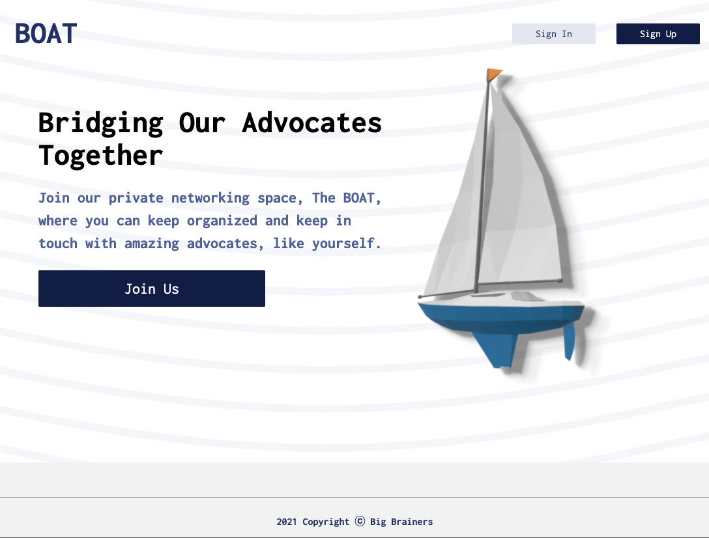
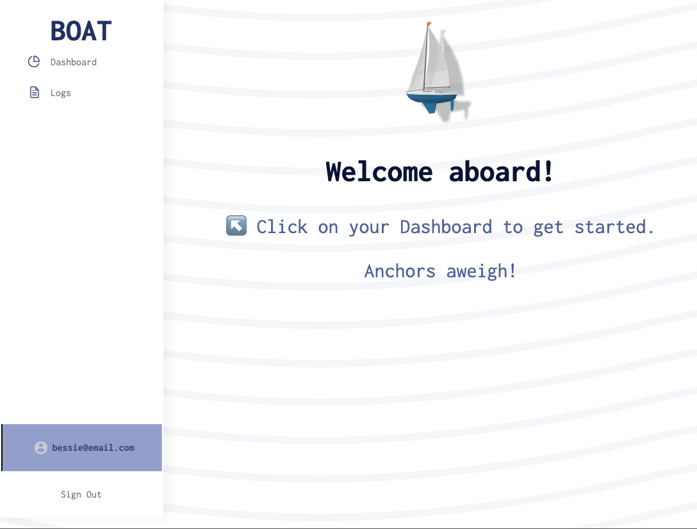
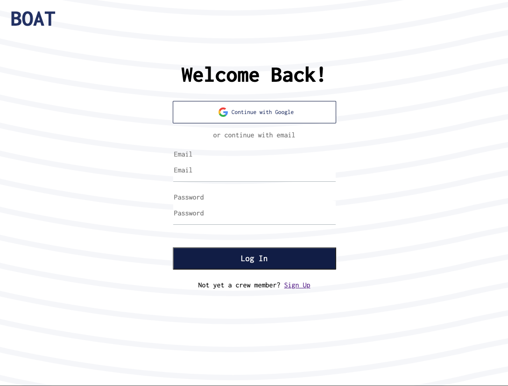
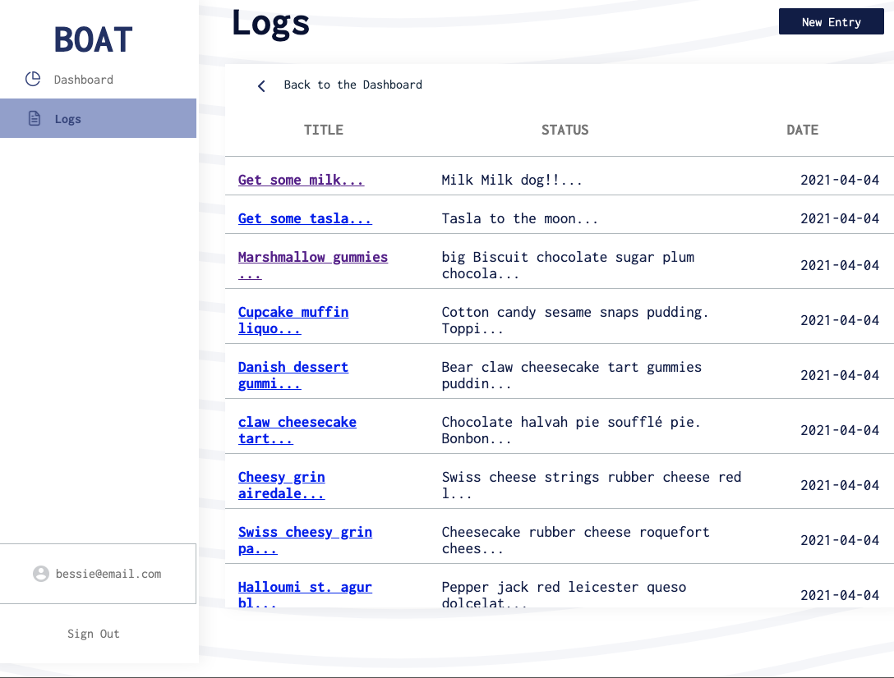
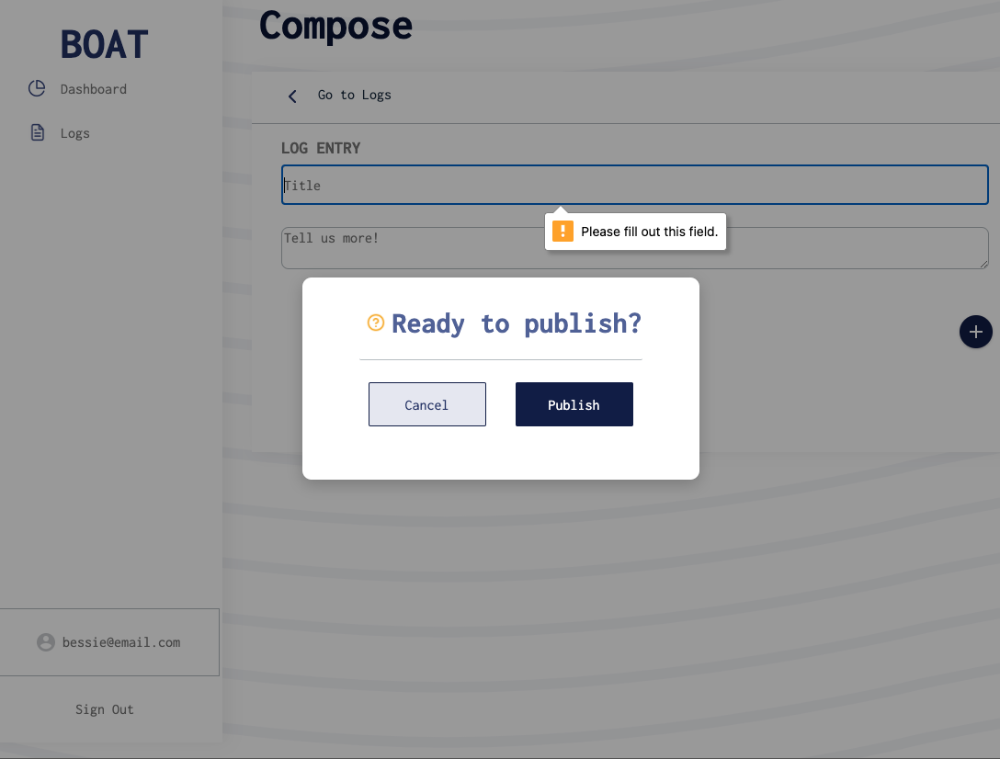
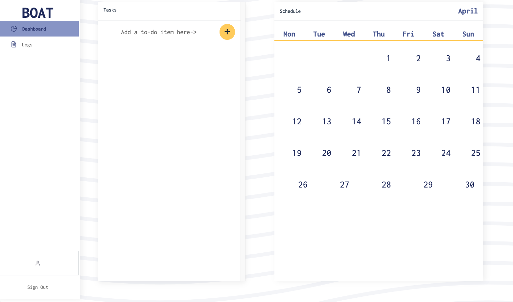
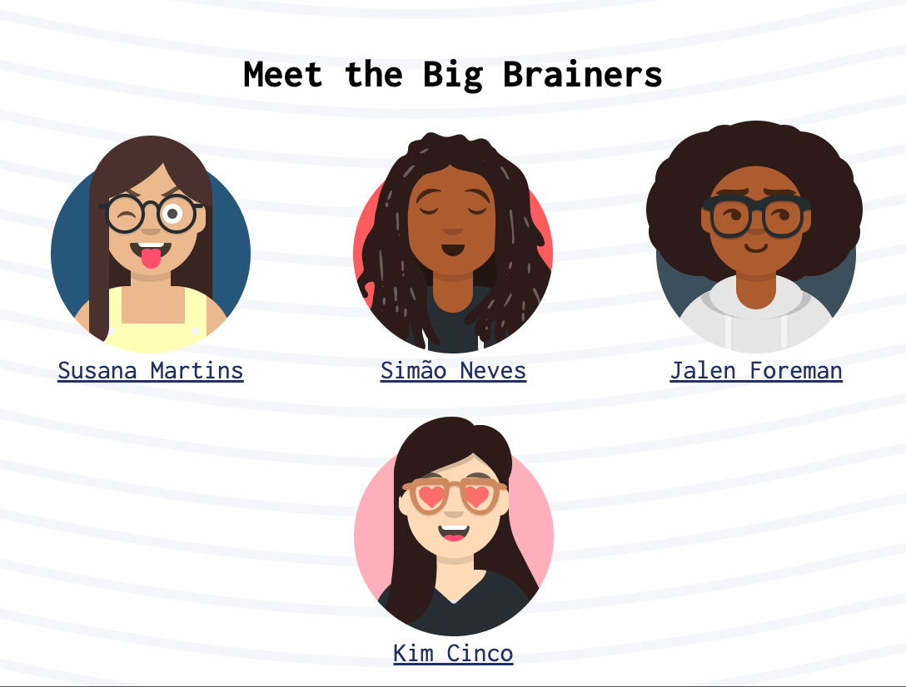

# BOAT (aka Bridging Our Advocates Together) app

### Project 3 for General Assembly's remote Software Engineering Immersive program

> Bridging our Advocates Together (aka BOAT) is a documentation system stored in a private dashboard for advocate volunteers. This dashboard includes a logs manager, a scheduler, and a way to manage your tasks all in one platform.

### Contributors

- [Simão Neves](https://github.com/Nevsimao03)
- [Jalen Foreman](https://github.com/Jalen-Foreman)
- [Susana Martins](https://github.com/5usana)
- [Kim Cinco](https://github.com/kccrtv)

# ScreenShots

### Welcome/Dashboard Page

### SignUp page

### SignIn page

### Log Entries

### Log Entry

### Publish Entry

### Schedule (dynamic but functionaility incomplete)

### Big Brainers

# The Approach Taken

# Features

### Landing Page

### Sign Up Page

### Log In Page

### Dashboard Overview

### Logs Page

### Add a single entry

# Technologies Used

- MERN

### Organization / Guidance

- Discord
- Slack
- Zoom
- Miro
- Google Docs

### Design

- Figma
- Giphy

### Development

- VS Code, CodeSandbox
- Google Chrome + Developer Tools
- Mozilla Firefox + Developer Tools
- HTML
- CSS Grid, CSS Flexbox
- React.js, React Router, React Styled-Components
- MongoDB, Node.js, Express.js, Mongoose JSON RESTful API

# Getting Started/Installation Instructions

This project was bootstrapped with [Create React App](https://github.com/facebook/create-react-app).

# Contribution Guidelines

The contribution process currently relies on some knowledge of working with Github and writing in Markdown. Here are some resources/helpful links to understand both:

- [Chaser Pettit's introduction to the GitHub workflow](https://gist.github.com/Chaser324/ce0505fbed06b947d962)
- [Basic Markdown Syntax](https://www.markdownguide.org/basic-syntax/)

Requests to contribute (contribute to your code, identify bugs, and/or propose improvements) can be made via [pull request](https://github.com/big-brainers/boat-frontend/compare) or [issue](https://github.com/big-brainers/boat-frontend/issues/new/choose). Thank you!

### References/Credits:

https://yizhiyue.me/2020/01/04/how-to-create-a-simple-react-calendar-with-styled-component
https://www.udemy.com/course/the-complete-web-development-bootcamp/
https://www.svgbackgrounds.com/
https://codesandbox.io/s/34z5152z1q?file=/index.js
https://www.saasdesign.io/
https://www.figma.com/community/file/809559910249051285
https://setproduct.com/s8
https://elements.heroku.com/buildpacks/mars/create-react-app-buildpack
https://devcenter.heroku.com/articles/nodejs-support#customizing-the-build-process
https://github.com/heroku/heroku-repo
https://create-react-app.dev/docs/deployment/#heroku
https://help.heroku.com/18PI5RSY/how-do-i-clear-the-build-cache
https://devcenter.heroku.com/articles/duplicate-build-version
https://stackoverflow.com/questions/30991736/heroku-procfile-running-npm-start
https://stackoverflow.com/questions/10451330/clean-git-repo-on-heroku
https://help.heroku.com/FZDDCBLB/how-can-i-download-my-code-from-heroku
https://developer.mozilla.org/en-US/
https://www.w3schools.com/
https://styled-components.com/

## Available Scripts

In the project directory, you can run:

## Acknowledgments

Our stellar team Big Brainers for all the hard work and contribution. GA Instructors for the SEIR-201 course and our extremely supportive cohort

### `npm start`

Runs the app in the development mode.\
Open [http://localhost:3000](http://localhost:3000) to view it in the browser.

The page will reload if you make edits.\
You will also see any lint errors in the console.

### `npm test`

Launches the test runner in the interactive watch mode.\
See the section about [running tests](https://facebook.github.io/create-react-app/docs/running-tests) for more information.

### `npm run build`

Builds the app for production to the `build` folder.\
It correctly bundles React in production mode and optimizes the build for the best performance.

The build is minified and the filenames include the hashes.\
Your app is ready to be deployed!

# Unsolved Problems

The Calendar is dynamic but not funcitonal, this component is a stretch goal.
MVP: responsive breakpoints could be improved, accessibility had warnings, but not issues that needed immediate attention

### References/Credits:

https://www.udemy.com/course/the-complete-web-development-bootcamp/
https://www.freepik.com/vectors/background
https://fonts.google.com/specimen/Inconsolata?preview.text_type=custom
https://avataaars.com/
https://favicon.io/favicon-converter/
